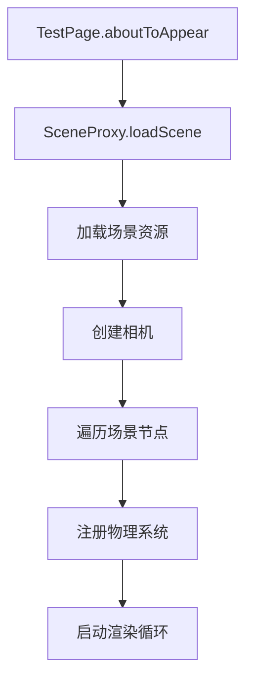

# 3D 物体布局系统设计文档

## 1. 现有架构分析

### 1.1 核心模块

```
entry/src/main/ets/core/scene3D/
├── GlobalSceneProxy.ets      # 场景代理（单例模式）
├── PhysicsSystemManager.ets  # 物理系统管理
├── EventQueue.ets            # 事件队列管理（双缓冲）
├── EventTypes.ets            # 事件类型定义
├── PhysicsAdapter.ets        # 物理数据适配器
├── TouchRotate.ets           # 触摸旋转处理
└── Utils.ets                 # 工具类（NodeUtil, lookAt 等）
```

### 1.2 场景加载流程



### 1.3 3D 物体加载方式

#### 方式一：从预制资源加载节点
```typescript
// GlobalSceneProxy.ts
async addNode(res: string, name:string, reName:string):Promise<Node | undefined>{
  let resource = this.resMap.get(res);
  if(!resource) return;
  let resScene = await Scene.load(resource);
  let nodeQueue:Node[] = [];
  if (resScene.root) { nodeQueue.push(resScene.root); }
  while(nodeQueue.length != 0) {
    let parent = nodeQueue.pop();
    if(parent && parent?.name == name){
      let node = this.scene?.importNode(reName,parent,this.scene.root);
      if(node && node.nodeType == NodeType.GEOMETRY){
        this.physicalSystem.registerNode(node,true);
      }
      return node;
    }
    let count = parent?.children.count();
    if (count) {
      for(let i = 0; i < count; i++) { 
        nodeQueue.push(parent?.children.get(i) as Node)
      }
    }
  }
  return;
}
```

#### 方式二：添加图片卡片（带 Shader）
```typescript
async addCard(ImageUri:string,shaderName:string){
  let node = await this.addNode('card','Cube',shaderName);
  let factory = this.scene?.getResourceFactory();
  if(factory && node){
    NodeUtil.attachShader(
      node,shaderName,$rawfile('shaders/Myshader/myshader.shader'),
      factory,"MyMATERIAL" + shaderName,'Image' + shaderName,ImageUri);
  }
}
```

#### 方式三：添加平面图片
```typescript
async addImage(imageUri:string, imageName:string){
  let node = await this.addNode('imagetest','plane','imageTest');
  let gemo = node as Geometry;
  // ... 遍历子网格并设置材质
  let material = mesh.material as MetallicRoughnessMaterial;
  let image = await factory.createImage(sceneImageParameter);
  material.baseColor.image = image;
  material.alphaCutoff = 0.5;
}
```

### 1.4 节点数据结构

```typescript
// PhysicsAdapter.ets
export interface PhysicsData{
  position: Vec3;      // 位置
  rotation: Vec4;      // 四元数旋转
  scale: Vec3;         // 缩放
  extent: Vec3;        // 包围盒范围
  shapeType: number;   // 形状类型 (AABB/SPHERE)
  isStatic: number;    // 是否静态
}
```

### 1.5 事件系统

```typescript
// EventTypes.ets
export enum EventType {
  TOUCH_DOWN = 1,
  TOUCH_MOVE = 2,
  TOUCH_UP = 3,
  RAYCAST_REQUEST = 100,
  ROTATE_REQUEST = 101,
  SET_PROPERTY_REQUEST = 102,
  RESET_GRAVITY = 103,
}

export enum Property {
  POS = 1,
  ROTATION = 2,
  SCALE = 5,
  MASS = 6,
  STATIC = 9,
  CAMERA = 50,
}
```

---

## 2. 布局系统设计

### 2.1 设计目标

1. **声明式布局**：类似 ArkUI 的声明式语法定义 3D 物体位置
2. **自动排布**：支持网格、列表、堆叠等布局模式
3. **响应式**：布局参数变化时自动更新物体位置
4. **物理集成**：与现有物理系统无缝集成

### 2.2 布局系统架构

```
entry/src/main/ets/core/scene3D/layout/
├── LayoutSystem.ets         # 布局系统核心
├── LayoutNode.ets           # 布局节点定义
├── LayoutTypes.ets          # 布局类型定义
├── GridLayout.ets           # 网格布局
├── ListLayout.ets           # 列表布局
├── StackLayout.ets          # 堆叠布局
└── FlexLayout.ets           # 弹性布局
```

### 2.3 核心接口定义

```typescript
// LayoutTypes.ets

/** 布局类型枚举 */
export enum LayoutType {
  GRID,      // 网格布局
  LIST,      // 列表布局（垂直/水平）
  STACK,     // 堆叠布局
  FLEX,      // 弹性布局
  ABSOLUTE   // 绝对定位
}

/** 布局配置接口 */
export interface LayoutConfig {
  type: LayoutType;
  // 网格布局参数
  gridColumns?: number;
  gridRows?: number;
  gridGap?: number;
  // 列表布局参数
  listDirection?: Axis;
  listSpacing?: number;
  // 通用参数
  padding?: Edge;
  alignment?: Alignment;
}

/** 3D 布局节点 */
@ObservedV2
export class LayoutNode {
  @Trace id: string;                    // 节点唯一标识
  @Trace position: Vec3;                // 计算后的位置
  @Trace rotation: Vec4;                // 计算后的旋转
  @Trace scale: Vec3 = {x:1,y:1,z:1};   // 缩放
  @Trace visible: boolean = true;       // 可见性
  @Trace sceneNode: Node | undefined;   // 关联的 3D 场景节点
  
  // 布局约束
  gridColumn?: number;
  gridRow?: number;
  flexGrow?: number;
  order?: number;
}

/** 布局系统 */
export class LayoutSystem {
  private layoutNodes: Map<string, LayoutNode> = new Map();
  private sceneProxy: SceneProxy;
  
  // 创建布局容器
  createLayout(config: LayoutConfig): string;
  
  // 添加节点到布局
  addNodeToLayout(layoutId: string, node: LayoutNode): void;
  
  // 移除节点
  removeNodeFromLayout(layoutId: string, nodeId: string): void;
  
  // 执行布局计算
  updateLayout(layoutId: string): void;
  
  // 应用布局结果到场景节点
  applyToScene(): void;
}
```

### 2.4 使用示例

#### 网格布局示例
```typescript
// 在 TestPage 中使用
const layoutSystem = new LayoutSystem(this.sceneProxy);

// 创建 3x3 网格布局
const gridLayoutId = layoutSystem.createLayout({
  type: LayoutType.GRID,
  gridColumns: 3,
  gridRows: 3,
  gridGap: 10,
  padding: { top: 20, left: 20, right: 20, bottom: 20 },
  alignment: Alignment.CENTER
});

// 加载 3D 物体并添加到布局
const node1 = new LayoutNode();
node1.id = "card_001";
node1.gridColumn = 1;
node1.gridRow = 1;
// 从预制资源加载
const sceneNode = await this.sceneProxy.addNode('card', 'Cube', 'card_001');
node1.sceneNode = sceneNode;
layoutSystem.addNodeToLayout(gridLayoutId, node1);

// 执行布局
layoutSystem.updateLayout(gridLayoutId);
layoutSystem.applyToScene();
```

#### 列表布局示例
```typescript
// 创建垂直列表
const listLayoutId = layoutSystem.createLayout({
  type: LayoutType.LIST,
  listDirection: Axis.VERTICAL,
  listSpacing: 15,
  alignment: Alignment.START
});

// 按顺序添加卡片
for (let i = 0; i < notes.length; i++) {
  const node = new LayoutNode();
  node.id = `note_${i}`;
  node.order = i;
  const sceneNode = await this.sceneProxy.addCard(imageUris[i], `shader_${i}`);
  node.sceneNode = sceneNode;
  layoutSystem.addNodeToLayout(listLayoutId, node);
}

layoutSystem.updateLayout(listLayoutId);
layoutSystem.applyToScene();
```

### 2.5 布局计算流程


### 2.6 与现有系统集成

#### 在 GlobalSceneProxy 中添加布局支持
```typescript
// GlobalSceneProxy.ts
@Trace layoutSystem: LayoutSystem = new LayoutSystem(this);

async addNodeToLayout(layoutId: string, res: string, name: string, 
                      layoutConfig: LayoutNodeConfig): Promise<string> {
  const nodeId = layoutConfig.id || `node_${Date.now()}`;
  const sceneNode = await this.addNode(res, name, nodeId);
  if (sceneNode) {
    const layoutNode = new LayoutNode();
    layoutNode.id = nodeId;
    layoutNode.sceneNode = sceneNode;
    Object.assign(layoutNode, layoutConfig);
    this.layoutSystem.addNodeToLayout(layoutId, layoutNode);
  }
  return nodeId;
}

updateLayouts() {
  this.layoutSystem.applyToScene();
}
```

#### 在 PhysicsSystemManager 中支持布局节点
```typescript
// PhysicsSystemManager.ets
registerNode(node: Node, isStatic: boolean = false, isLayoutNode: boolean = false): void {
  let id = this.physicsSystem.addNode(PhysicsAdapter.ToPhysicsData(node, ShapeType.AABB, true));
  this.idMap.set(node.path + '/' + node.name, id);
  this.nodeMap.set(node.name, node);
  
  // 布局节点标记
  if (isLayoutNode) {
    this.layoutNodeIds.add(id);
  }
  
  console.info("register info " + node.name + '/' + id.toString());
}
```

---

## 3. 实现优先级

### Phase 1: 基础框架
1. 创建 `LayoutTypes.ets` - 定义类型和接口
2. 创建 `LayoutNode.ets` - 实现布局节点类
3. 创建 `LayoutSystem.ets` - 实现核心布局系统

### Phase 2: 布局算法
1. 实现 `GridLayout.ets` - 网格布局算法
2. 实现 `ListLayout.ets` - 列表布局算法
3. 实现 `StackLayout.ets` - 堆叠布局算法

### Phase 3: 集成测试
1. 在 `GlobalSceneProxy` 中集成布局系统
2. 在 `TestPage` 中测试布局功能
3. 优化性能（批量更新、脏标记）

### Phase 4: 高级特性
1. 响应式布局（@ObservedV2 自动更新）
2. 动画过渡支持
3. 与物理系统深度集成

---

## 4. 注意事项

1. **坐标系**：ArkGraphics3D 使用右手坐标系，Y 轴向上
2. **性能**：布局计算应在帧更新之外进行，避免卡顿
3. **内存**：及时清理不用的布局节点，避免内存泄漏
4. **同步**：布局更新后需调用 `applyToScene()` 同步到渲染
